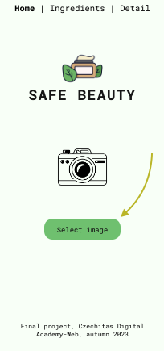
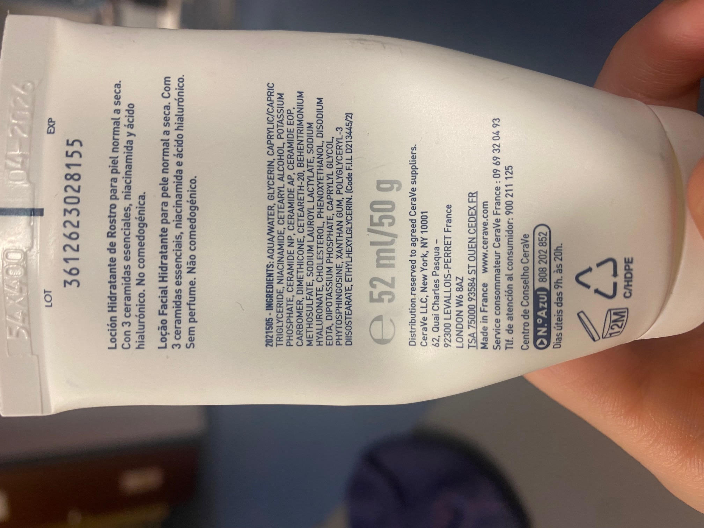
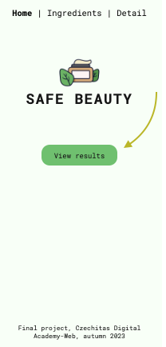
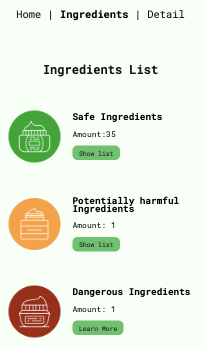
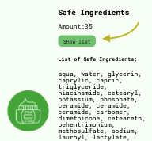
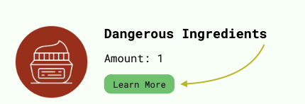
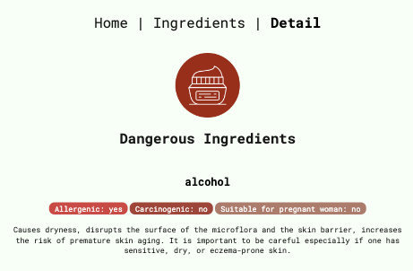

# Safe Beauty

Safe Beauty is a project developed to help users orient themselves in the complicated world of cosmetic products' ingredients. With the help of this simple app users can check if there are any dangerous or potentially harmful ingredients inside and make sure they make informed decisions!

Available at https://safe-beauty.vercel.app

## Getting Started

Please, go to https://safe-beauty.vercel.app, and select image

--> Sample image for testing the servise:

Press "View results":

And view results:

For more details, you can choose to view the list of safe / potentially harmful ingredients or view the detailed description of the dangerous ones:

## Feedback

Please, share your experience with us at [elizabet.p@email.cz] or in the comments section to this repository [https://github.com/hanellev/Safe-Beauty-App/]! Í
